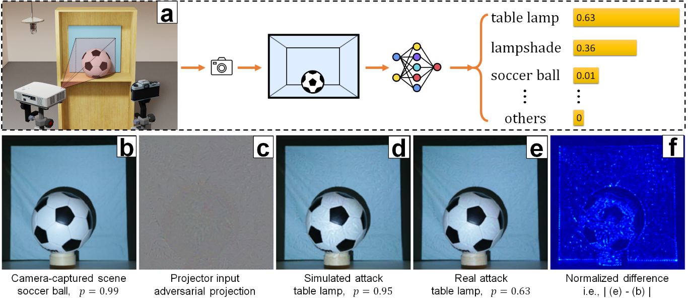

# SPAA: Stealthy Projector-based Adversarial Attacks on Deep Image Classifiers [IEEE VR'22]

<p align="center">
  <!--  -->
  
</p>

Please watch the [IEEE VR'22 presentation][8] for a quick introduction of our work.


---


## Introduction

PyTorch's implementation of SPAA ([paper][1]). Please refer to [supplementary material (~66MB)][2] for more results.

## Prerequisites

* PyTorch compatible GPU with CUDA 11.7
* Conda (Python 3.9)
* Other packages are listed in [requirements.txt](requirements.txt).

## Usage
#### Reproduce paper results
1. Create a new conda environment:
   ```
   conda create --name spaa python=3.9
   activate spaa       # Windows
   conda activate spaa # Linux
   ```
2. Clone this repo:
   ```
   git clone https://github.com/BingyaoHuang/SPAA
   cd SPAA
   ```
3. Install required packages by typing
   ```
   pip install -r requirements.txt
   ```
4. Download SPAA [benchmark dataset (~3.25 GB)][3] and extract to [`data/`](data), see [`data/README.md`](data/README.md) for more details.
5. Start **visdom** by typing the following command in local or server command line:
   `visdom -port 8097`
6. Once visdom is successfully started, visit [`http://localhost:8097`](http://localhost:8097) (train locally) or `http://server:8097` (train remotely).
7. Open [`reproduce_paper_results.py`](src/python/reproduce_paper_results.py) and set which GPUs to use. An example is shown below, we use GPU 0.
   `os.environ['CUDA_VISIBLE_DEVICES'] = '0'`
8. Run [`reproduce_paper_results.py`](src/python/reproduce_paper_results.py) to reproduce benchmark results.
   ```
   cd src/python
   python reproduce_paper_results.py
   ```
---
#### Compare the three projector-based attackers in your setups
1. Finish the steps above.
2. Open `main.py` and follow the instructions there. Execute each cell (starting with `# %%`) one-by-one (e.g., use PyCharm **Execute cell in console**) to learn how to set up your projector-camera systems, capture data, train PCNet/CompenNet++, perform the three projector-based attacks (i.e., SPAA/PerC-AL+CompenNet++/One-pixel_DE), and generate the attack results.
3. The results will be saved to `data/setups/[your setup]/ret`
4. Training results of PCNet/CompenNet++ will also be saved to `log/%Y-%m-%d_%H_%M_%S.txt` and `log/%Y-%m-%d_%H_%M_%S.xls`.

---

## Citation

If you use the dataset or this code, please consider citing our work
```
  @inproceedings{huang2022spaa,
      title      = {SPAA: Stealthy Projector-based Adversarial Attacks on Deep Image Classifiers},
      booktitle  = {2022 IEEE Conference on Virtual Reality and 3D User Interfaces (VR)},
      author     = {Huang, Bingyao and Ling, Haibin},
      year       = {2022},
      month      = mar,
      pages      = {534--542},
      publisher  = {IEEE},
      address    = {Christchurch, New Zealand},
      doi        = {10.1109/VR51125.2022.00073},
      isbn       = {978-1-66549-617-9}
  }
```

## Acknowledgments

- This code borrows heavily from 
  - [CompenNet][5] and [CompenNet++][4] for **PCNet/CompenNet++**.
  - [Hyperparticle/one-pixel-attack-keras][6] for **One-pixel_DE** attacker.
  - [ZhengyuZhao/PerC-Adversarial][7] for **SPAA**, **PerC-AL+CompenNet++** attackers and differentiable CIE deltaE 2000 metric.
  - [cheind/py-thin-plate-spline][9] for `pytorch_tps.py`.
  - [Po-Hsun-Su/pytorch-ssim][10] for PyTorch implementation of SSIM loss.
- We thank the anonymous reviewers for valuable and inspiring comments and suggestions.
- We thank the authors of the colorful textured sampling images.
- Feel free to open an issue if you have any questions/suggestions/concerns 😁. 

## License

This software is freely available for non-profit non-commercial use, and may be redistributed under the conditions in [license](LICENSE).

[1]: https://bingyaohuang.github.io/pub/SPAA
[2]: https://bingyaohuang.github.io/pub/SPAA/supp
[3]: https://bingyaohuang.github.io/pub/SPAA/data
[4]: https://github.com/BingyaoHuang/CompenNet-plusplus
[5]: https://github.com/BingyaoHuang/CompenNet
[6]: https://github.com/Hyperparticle/one-pixel-attack-keras
[7]: https://github.com/ZhengyuZhao/PerC-Adversarial
[8]: https://youtu.be/7oSh5BmJDJ8?list=PLmkIPPvcHLZgWaBGqwiAe52PLDNnMtIA5&t=477
[9]: https://github.com/cheind/py-thin-plate-spline
[10]: https://github.com/Po-Hsun-Su/pytorch-ssim

